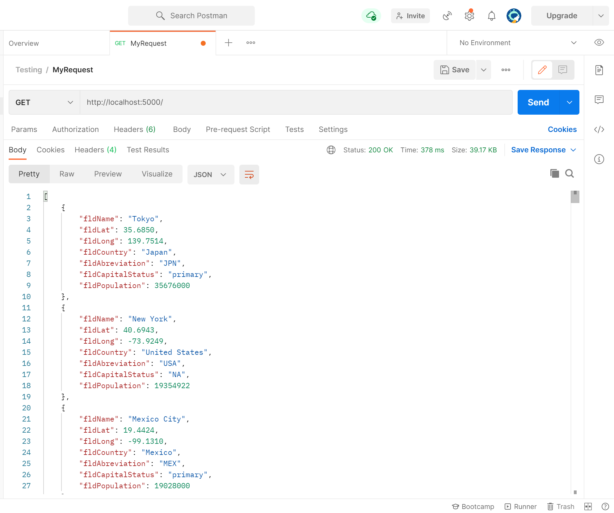
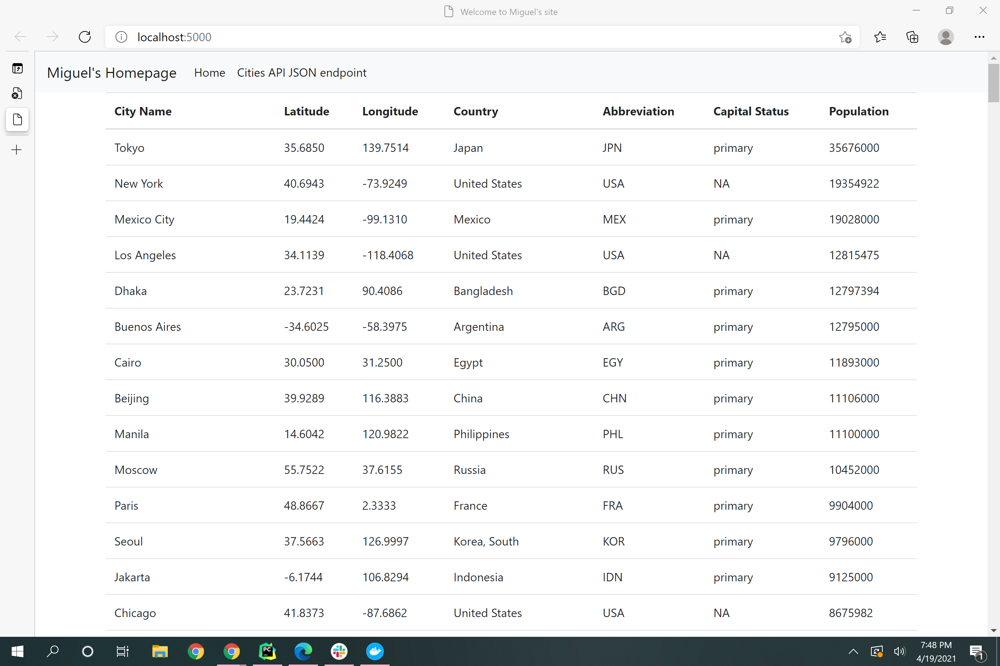
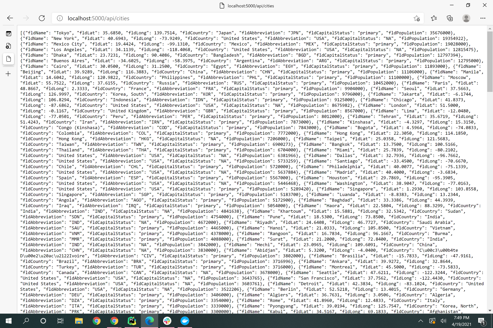

## How to get Pycharm setup with Docker, Flask, MySQL, and Postman

## About 
This project is a homework assignment that is a part of the Web system development course curriculum. The objective is to teach how to get Pycharm set up with Docker, Flask, MySQL, and Postman. 

# Postman Screenshot 

# SQL Data ScreenShot

# Table View

# Jason View 
